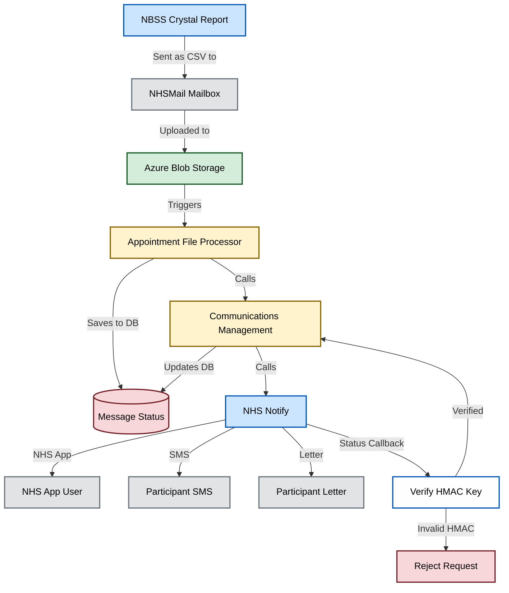

# Communication Management (National Screening Platform)

This repository makes up the NSP component that handles communication with NHS Notify.

At present, this component is processing a file, and then using the appointment data in that file to create an event, and calling NHS Notify with the payload.
In future, the file processing will be removed, and the event subscription will remain.

Here's a diagram:

## Contacts

For any info please contact the [Invite team on Slack](https://nhsdigitalcorporate.enterprise.slack.com/archives/C07QHFSV79U)

## Licence

> The [LICENCE.md](./LICENCE.md) file will need to be updated with the correct year and owner

Unless stated otherwise, the codebase is released under the MIT License. This covers both the codebase and any sample code in the documentation.

Any HTML or Markdown documentation is [© Crown Copyright](https://www.nationalarchives.gov.uk/information-management/re-using-public-sector-information/uk-government-licensing-framework/crown-copyright/) and available under the terms of the [Open Government Licence v3.0](https://www.nationalarchives.gov.uk/doc/open-government-licence/version/3/).
